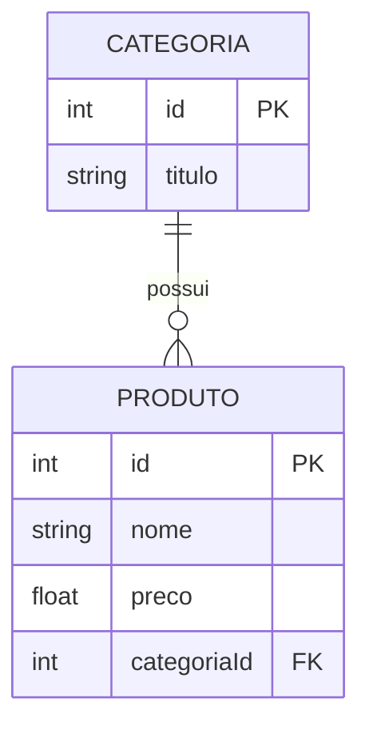

<p align="center">
  
</p>

<h1 align="center">🕹️ Game Store API</h1>

<p align="center">
  <em>API backend com NestJS para gerenciar uma loja de games</em>
</p>

<p align="center">
  
  
  
  
  
  
</p>

---

## 📖 Sobre o Projeto

API completa para gerenciar **Produtos e Categorias** de uma loja de games, desenvolvida com **NestJS** seguindo boas práticas de arquitetura com módulos, controllers e serviços bem separados.

---

## ✨ Funcionalidades

| Recurso | Descrição |
|---|---|
| 🎮 **CRUD de Produtos** | Criar, listar, atualizar e remover jogos |
| 🗂️ **CRUD de Categorias** | Gerenciar categorias dos produtos |
| 🔍 **Busca por ID** | Encontrar produto ou categoria por identificador |
| 🔤 **Busca por Título** | Encontrar categorias pelo nome |
| 🏗️ **Arquitetura Limpa** | Controller / Service / Entity bem organizados |

---

## 🏗️ Estrutura do Projeto

```
src/
├── produto/
│   ├── entities/
│   │   └── produto.entity.ts
│   ├── produto.controller.ts
│   ├── produto.service.ts
│   └── produto.module.ts
├── categoria/
│   ├── entities/
│   │   └── categoria.entity.ts
│   ├── categoria.controller.ts
│   ├── categoria.service.ts
│   └── categoria.module.ts
└── app.module.ts
```

---

## 🗂️ Diagrama ER



---

## 🚀 Como Executar

### Pré-requisitos

- Node.js v20+
- MySQL v8+
- npm ou yarn

### Instalação

```bash
# Clone o repositório
git clone https://github.com/seu-usuario/game-store-api.git

# Acesse a pasta do projeto
cd game-store-api

# Instale as dependências
npm install
```

### Rodando a aplicação

```bash
# Desenvolvimento (com hot reload)
npm run start:dev

# Produção
npm run start:prod
```

> A API estará disponível em `http://localhost:3000`

---

## 🔗 Endpoints da API

### 🎮 Produto

| Método | Rota | Descrição |
|--------|------|-----------|
| `POST` | `/produto` | Criar um novo produto |
| `GET` | `/produto` | Listar todos os produtos |
| `GET` | `/produto/:id` | Buscar produto por ID |
| `PUT` | `/produto` | Atualizar produto |
| `DELETE` | `/produto/:id` | Remover produto |

### 🗂️ Categoria

| Método | Rota | Descrição |
|--------|------|-----------|
| `POST` | `/categoria` | Criar uma nova categoria |
| `GET` | `/categoria` | Listar todas as categorias |
| `GET` | `/categoria/:id` | Buscar categoria por ID |
| `GET` | `/categoria/titulo/:titulo` | Buscar categoria por título |
| `PUT` | `/categoria` | Atualizar categoria |
| `DELETE` | `/categoria/:id` | Remover categoria |

---

## 🧪 Testando com Insomnia

1. Abra o **Insomnia** e crie uma nova Workspace chamada `Game Store API`
2. Adicione requests com os **métodos e URLs** listados acima
3. Para `POST` e `PUT`, selecione o body como **JSON**
4. Exemplo de payload para criar um produto:

```json
{
  "nome": "The Last of Us Part II",
  "preco": 199.90,
  "categoriaId": 1
}
```

5. Envie e confira os retornos! 🎯

---

## 🎯 Aprendizados do Projeto

- ✅ Construção de APIs RESTful com **NestJS**
- ✅ CRUD completo para múltiplos recursos
- ✅ Relacionamento **One-to-Many** com TypeORM
- ✅ Separação de responsabilidades: **Controller / Service / Entity**
- ✅ Boas práticas com **TypeScript**

---

## 👩‍💻 Autora

<p>
  <strong>Lohanna B</strong>
  <br/>
  Feito com 💜 e muito ☕
</p>

---

## 📄 Licença

Este projeto está sob a licença **MIT**. Veja o arquivo [LICENSE](LICENSE) para mais detalhes.
